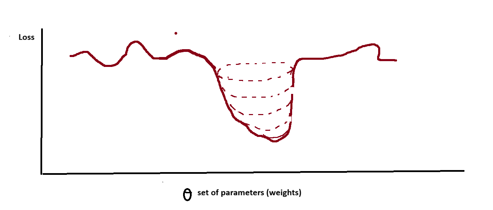
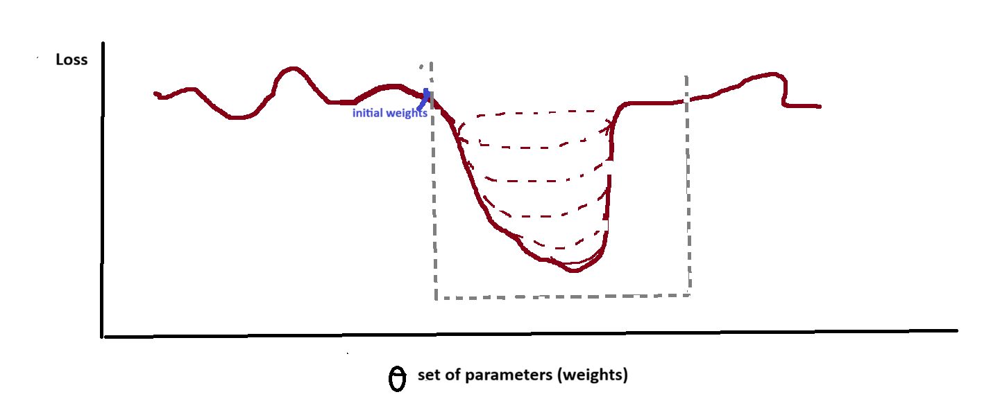

# Understanding loss surface of neural nets

lets say above is loss surface

So, we can see, this is non-convex loss function.

**But if we initialize weights in such a way that we start at good point**

meaninig

so, we can see , we get convex loss surface portion

So, optimizer (gradient descent) can easily find global minima

So, this paper tells this, **importance of weight initialization for neural nets**

This tells us **Importance of weight initialization**

**_Same applies for batch Norm, Dropout, batch data etc_**
