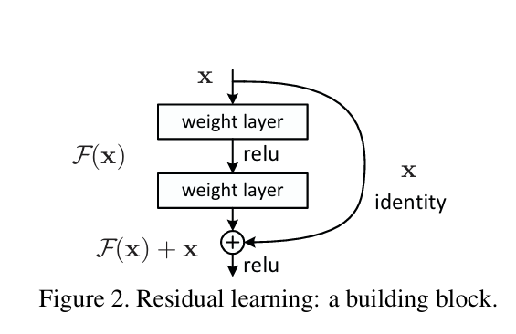

# Resnet explained

> [!Note]
> Read Notes, paper (highlighted content) and watch Yann clitcher downloaded YT video. Do this multiple times and you will get it

As number of layers increases, neural networks become difficult to train.

Vanishing/exploding gradient was a problem but it was solved by normalized initialization & batch normalization layers

But new problem arise which is known as degradation problem. During training deep networks, accuracy saturates and degrades rapidly. This is not overfitting because in overfitting, training accuracy is high and test accuracy is low.

This accuracy drop during training suggests that layers in network struggles to learn optimal function. Meaning, they have difficulty in optimization , meaning, they have difficulty in finding the weights that produce optimal H(x) (optimal function which then produce minimum loss)

**So, the problem is in optimization/learning**

Due to this, shallow network have high accuracy than deeper network

So, to solve this, we consider a solution

We take a shallow network and its counter deeper network. we train the shallow network and copy those learned layers into its counter deeper network. remaining layers in deeper network should perform identity mapping. Meaning, input passes as it is to output.

This is how, we can have deeper network perform as good as shallow network

But layers struggles to learn identity mapping. As weight layers are initialized as zero centered values (unit gaussian initialization) - **Layers initialized near zero produce near-zero outputs**. For identity mapping, layers need to have specific weight values that keeps input unchanged. This is difficult to achieve and maintain. Also, non-linearities between layers makes identity learning more difficult.

**from ResNet paper**

```
"The degradation problem suggests that the solvers might have difficulties in approximating identity mappings by multiple nonlinear layers."

```

So, we can say, that plain neural networks struggles to learn identity mapping.

solution is, **Residual learning**.

> [!Note]  
> researcher hypothesize that identity mapping is important for neural networks. So, we should be able to make neural networks learn identity easily

## Residual connection / skip connection

Now, we explicitly let this layers learn F(x) (small change or deviation on input x)



Now, we structure the layers in such a way that neural network passes x through layers and also directly to layer's output end.

So, here layers learn F(x) and then F(x) is added in input x to get optimal H(x)

H(x) = F(x) + x

> [!Important]  
> Plain network learns H(x) (optimal function from scratch). But this residual network learns H(x) with the help of F(x) + x.
> because In ResNet , H(x) = F(x) + x. So, here optimizer learns H(x) by taking help of input x (due to skip connection). taking help of F(x) depends on H(x). If `H(x) ≈ x` is optimal function i.e identity is optimal, then optimizer update weights in a way that produce `F(x) ≈ 0`. And if H(x) is non-identity, then optimizer updates weights in a way that produce optimal F(x) (small deviation needed in x to produce optimal H(x)) and this optimal F(x) will subsequently produce optimal H(x)

## Understand why H(x) is difficult to optimize / lear in Plain nets

lets understand why H(x) is harder to learn/optimize in plain deep networks

Understand it with the example.

lets say we have a subpart of deep neural network like above. It has to learn optimal function H(x). here optimal function H(x) means it will produce minimum loss

learning optimal H(x) means finding weights that produce optimal H(x) and this produces minimum loss

lets say,  
optimal H(x) = 2 (output after series of linear transformation & non-linearity on input x)

here, H(x)=2 is harder optimization i.e optimizer struggles to find weights that produce H(x)=2.

Reason that optimizer struggles to find H(x)=2 is,

- weight layers are already initialized as zero centered values (Unit Gaussian). so, initialy H(x) will be near 0. So, optimizer starts with near 0 value and climbs for H(x)=2

**And if optimal H(x) is identity function, then also its very hard. because optimizer struggles to find weights that keeps input x unchanged.**

```

Why plain net struggles to learn identity if its optimal?

In a plain net, to make layers to perform identity, the stacked layers must find the exact weights that make them behave like identity, which is a specific point in weight space and hard to reach with nonlinearities in between

```

> [!Note]  
> Here, H(x) is unreferenced function. Meaning, it does not have any reference to start optimizing or learning. Meaning, optimizer starts with random weights, produces invalid H(x) (which will be near 0, because initial weights are near 0), then again backprop, weight update, again produce H(x) which is better than previous but not yet optimal. So, this is problem of optimization of original, unreferenced function

## Residual learning

Now, Resnet introduce a new learning framework.

Instead of learning H(x) from scratch, we let this layers learn F(x)

**F(x) is the residual**

F(x) is small deviation or change needed in input x which produces optimal H(x)

i.e F(x) = H(x) - x

so, instead of directly learning H(x), layers learn F(x) and then adds F(x) into input x to get H(x)

so, H(x) = F(x) + x

## Why learning F(x) is easier than H(x)

The structure of Resnet produces H(x) with the help of F(x) & x

F(x) is produced through linear transformations & non-linearity applied to input x

x is input directly passes to output end with the help of skip connection

Both F(x) & x is added to get H(x)

Lets understand why F(x) is easy to learn with example,

let x = 1.2,

optimal H(x) = 2

so F(x) = 0.8

**Without skip connection**:

Output = H(x) (layers must produce the full answer)

If weights are near zero → output ≈ 0

So layers start from 0 and must learn to produce H(x) = 2

i.e to find weights that produce H(x)=2

Reference ≈ 0

**With skip connection**:

Output = F(x) + x

If weights are near zero → F(x) ≈ 0 → output = 0 + x ≈ x ≈ 1.2

So even with zero weights, output is already 1.2, not 0.

Layers only need to learn the remaining 0.8 i.e F(x)

Reference ≈ x ≈ 1.2 (identity)

That's the only point being made.

The skip connection means the default output (when weights are zero) is x, not 0. So layers have a better starting point before any learning even begins.

**from paper**

```
"Formally, denoting the desired
underlying mapping as H(x), we let the stacked nonlinear
layers fit another mapping of F(x) := H(x) − x. The orig
inal mapping H(x) is recast into F(x) + x. We hypothesize that it
is easier to optimize the residual mapping F(x) than to optimize
the original, unreferenced mapping H(x)."
```

The above meaning is, Its easy to learn F(x) (small deviation or change in input x that will produce optimal H(x)) then to learn H(x) from scratch (i.e with no reference).

> [!Note]  
> Question will arise in mind. How F(x) is learned by layers. Answer is, In resnet, H(x) is calculated as F(x) + x. Optimizer starts with H(x) = x (i.e initially F(x) ≈ 0 due to initial random weights) and optimizer adjust layer weights in such way that F(x) + x produces optimal H(x). Meaning, It finds weights that produce optimal F(x) and this optimal F(x) produce optimal H(x). All this due to backprop.  
> So, if optimal H(x) is identity (output = input), optimizer simply push weight layers towards 0 i.e F(x)=0. If optimal H(x) is near identity or non-identity, optimizer learns F(x) (means adjusts weights that produce optimal F(x)) and this learned F(x) is added into x to get H(x)

So, layers start to learn with the reference of input x. So, its easier optimization target

In ResNet, optimal H(x) have 2 possibility

- If H(x) is identity
- If H(x) is non-identity or near identity

1. **If optimal H(x) is identity**

If identity is optimal function, then resnet can learn/optimize it easily because optimizer can simply push weights towards zero i.e F(x) = 0

As layers are zero centered values, optimizer can push them towards zero. i.e F(x) = 0. So, H(x) becomes identity function

H(x) = F(x) + x

H(x) = 0 + x

H(x) = x

**So, Resnet can easily learn and perform identity function**

2. **If optimal H(x) is near identity or non-identity**

Resnet architecture works well when layers need to learn and perform identity mapping.

But what if optimal function for layers is not identity. Meaning, layers need to learn and perform another function than identity (maybe near identity or non-identity).

Even in this case, ResNet works well.  

**from paper**
```
In real cases, it is unlikely that identity mappings are op
timal, but our reformulation may help to precondition the
problem. If the optimal function is closer to an identity
mapping than to a zero mapping, it should be easier for the
solver to find the perturbations (weights) with reference to an identity
mapping, than to learn the function as a new one. We show
by experiments (Fig. 7) that the learned residual functions in
general have small responses, suggesting that identity map
pings provide reasonable preconditioning.

This says, In real cases, identity is not optimal. So, If neural network have
near identity or non-identity as optimal function, then also our
reformulation (having skip connection to perform identity mapping) helps.
In such case, optimizer starts with input x or near x (if F(x) has some value), and
climbs for weights that produce optimal F(x). and This optimal F(x) will produce optimal H(x).
This says that it is easier to find weights with the reference to x then
to find weights for H(x) from scratch (with no reference).  
They showed with the help of expirements that this learned F(x) (optimal F(x))
have smaller values / responses (meaning, original x and H(x) have very small difference i.e optimal H(x) is close to original input x).
The small responses are evidence that the optimal H is close to identity, which is why starting there helps.
```

ResNet performs identity through skip connection. Input passes as it is to output end. layers learn F(x) (deviation needed in x) and added into x to get optimal H(x)

> [!Important]  
> ResNet hypothesize that F(x) is small. They (researcher) calculated responses of layers in ResNets and plain net.  
> They found that learned plain net layers have high magnitude response. Meaning they learn more.  
> But resnet layers have small magnitude responses suggesting that ResNet layers learns small deviation or change in input x.  
> ResNet architecture was built on the hypothesis that layers (especially deeper layers) mostly learn identity mapping. If not, they only change input signal little bit. So, having skip connections allows layers to easily learn and perform identity. And if identity is not optimal, then layers can learn change or deviation needed in input x

**from Claude**

```
In a residual block, identity corresponds to F(x) = 0, which the optimizer reaches simply by driving the weights toward zero. If the optimal function is closer to identity than to a zero mapping, learning a perturbation around x is easier than learning H(x) from scratch. This is a hypothesis, not a guarantee, and the paper's layer-response analysis in fig.7  supports it empirically.
```

## The hypothesis behind residual learning

But a question will arise. why optimal H(x) will be near input x

Whole Resnet works only because it gives optimizer a input x as starting point. And optimizer starts with input x. and finds optimal H(x).

Also, F(x) learns by taking reference of input x

This concludes that optimal H(x) is near x input.

But we would think why optimal H(x) is near input x.

You've hit the exact right question. And the honest answer is:

**It is NOT guaranteed that optimal H(x) is close to x.**

---

**What is actually true:**

The ResNet paper's hypothesis is that in practice, for deep networks, **many layers end up needing to learn something close to identity** — meaning the optimal H(x) for many blocks is close to x.

Evidence for this: plain nets degrade when going deeper. Meaning extra layers are hurting. Which suggests those extra layers ideally should be doing nothing useful — i.e. identity is optimal for them.

---

**So the claim is not:**

"Starting from x is always a good starting point"

**The claim is:**

"For layers where identity is optimal or near-optimal, ResNet makes it easy. For layers where identity is not optimal, ResNet at least gives a stable non-zero starting point instead of near-zero."

---

**In short:**

- Best case → identity is optimal → F(x) → 0, trivially solved
- Worst case → identity is not optimal → still better than starting from 0, because x carries useful signal

It's not a guarantee. It's a **well-motivated hypothesis** that worked extremely well in practice.
